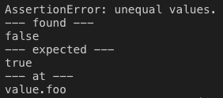

# assert

Opinionated test assertion.

[](https://github.com/jsenv/jsenv-assert/packages)
[](https://www.npmjs.com/package/@jsenv/assert)
[](https://github.com/jsenv/jsenv-assert/actions?workflow=ci)
[](https://codecov.io/gh/jsenv/jsenv-assert)

# Table of contents

- [Presentation](#Presentation)
- [Installation](#Installation)
  - [Browser usage](#Browser-usage)
  - [Node usage](#Node-usage)
- [How it works](#How-it-works)
- [Successfull comparison examples](#Successfull-comparison-examples)
- [Failing comparison examples](#Failing-comparison-examples)
  - [Failing on value](#Failing-on-value)
  - [Failing on prototype](#Failing-on-prototype)
  - [Failing on property value](#Failing-on-property-value)
  - [Failing on properties order](#Failing-on-properties-order)
  - [Failing on property configurability](#Failing-on-property-configurability)
- [Why opinionated ?](#Why-opinionated-)

# Presentation

`@jsenv/assert` compare two values with extreme accuracy. If values differ, an error is thrown with a readable message.
`@jsenv/assert` helps you to know if the `actual` value produced in a test matches what you `expected`.

```js
import { assert } from "@jsenv/assert"

const actual = { foo: false }
const expected = { foo: true }
assert({ actual, expected })
```



# Installation

```console
npm install @jsenv/assert@2.0.0
```

## Browser usage

```html
<script type="module">
  import { assert } from "./node_modules/@jsenv/assert/index.js"
</script>
```

Or

```html
<script type="module">
  import { assert } from "https://unpkg.com/@jsenv/assert@latest/index.js"
</script>
```

Or

```html
<script src="https://unpkg.com/@jsenv/assert@latest/dist/global/main.js"></script>
<script>
  const { assert } = window.__jsenv_assert__
</script>
```

— see also https://jsenv.github.io/jsenv-assert/browser-interactive-example/browser-interactive-example.html.

## Node usage

```js
import { assert } from "@jsenv/assert"
```

Or for node < 13

```js
const { assert } = require("@jsenv/assert")
```

— see also https://jsenv.github.io/jsenv-assert/node-interactive-example/node-interactive-example.html

# How it works

`assert` does nothing when `actual` and `expected` comparison is successfull.<br />
`assert` throw an error if `actual` and `expected` comparison is failing.

`actual` and `expected` can be different objects but they must deeply look alike in every aspects possible in JavaScript.

To better understand if comparison will fail or not let's see some successfull comparison first and some failing comparisons afterwards.

# Successfull comparison examples

```js
import { assert } from "@jsenv/assert"

// dates
{
  const actual = new Date()
  const expected = new Date()

  assert({ actual, expected })
}

// errors
{
  const actual = new Error("message")
  const expected = new Error("message")

  assert({ actual, expected })
}

// objects without prototype
{
  const actual = Object.create(null)
  const expected = Object.create(null)

  assert({ actual, expected })
}

// regexps
{
  const actual = /ok/
  const expected = /ok/

  assert({ actual, expected })
}
```

# Failing comparison examples

Various code examples where comparison between `actual` and `expected` is failing.<br />
Each code example is followed with the console output.

## Failing on value

```js
import { assert } from "@jsenv/assert"

const actual = 10
const expected = "10"

try {
  assert({ actual, expected })
} catch (e) {
  console.log(e.message)
}
```

Console output

```console
AssertionError: unequal values.
--- found ---
10
--- expected ---
"10"
--- at ---
value
```

## Failing on prototype

```js
import { assert } from "@jsenv/assert"

const actual = new TypeError()
const expected = new Error()

try {
  assert({ actual, expected })
} catch (e) {
  console.log(e.message)
}
```

Console output

```console
AssertionError: unequal prototypes.
--- prototype found ---
global.TypeError.prototype
--- prototype expected ---
global.Error.prototype
--- at ---
value[[Prototype]]
```

## Failing on property value

```js
import { assert } from "@jsenv/assert"

const actual = { foo: true }
const expected = { foo: false }

try {
  assert({ actual, expected })
} catch (e) {
  console.log(e.message)
}
```

Console output

```console
AssertionError: unequal values.
--- found ---
true
--- expected ---
false
--- at ---
value.foo
```

## Failing on properties order

```js
import { assert } from "@jsenv/assert"

const actual = { foo: true, bar: true }
const expected = { bar: true, foo: true }

try {
  assert({ actual, expected })
} catch (e) {
  console.log(e.message)
}
```

Console output

```console
AssertionError: unexpected properties order.
--- properties order found ---
"foo"
"bar"
--- properties order expected ---
"bar"
"foo"
--- at ---
value
```

## Failing on property configurability

```js
import { assert } from "@jsenv/assert"

const actual = Object.defineProperty({}, "answer", { value: 42 })
const expected = { answer: 42 }

try {
  assert({ actual, expected })
} catch (e) {
  console.log(e.message)
}
```

Console output

```console
AssertionError: unequal values.
--- found ---
"non-configurable"
--- expected ---
"configurable"
--- at ---
value.answer[[Configurable]]
```

# Why opinionated ?

As shown `assert` is strict on `actual` / `expected` comparison. It is designed to make test fails if something subtle changes. Any subtle change in code might break things relying on it. You need that level of precision by default to ensure your code does not break a given contract.

> Contract example: calling function named `whatever` returns value `{ answer: 42 }`.

That being said you might need flexibility in your expectations. We could imagine pseudo code that would provide that flexibility and ensure only the value is a string or not an other value.

```js
assert({ actual: 11, expected: assert.not(10) })
// or
assert({ actual: "foo", expected: assert.any(String) })
```

In order to keep `assert` simple and opinionated it does not provide such api. Instead we recommend to `assert` exactly what you want to get the level of flexbility you need.

## any string

Expecting an object with a token property being any string.

```js
// assuming value is produced by an external function and produces a token randomly generated
const value = {
  whatever: 42,
  token: "a-random-string",
}
// first assert object looks correct being flexible on value.token
{
  const actual = value
  const expected = {
    whatever: 42,
    token: value.token,
  }
  assert({ actual, expected })
}
// then assert value.token is a string
{
  const actual = typeof value.token
  const expected = "string"
  assert({ actual, expected })
}
```

## any order

Expecting an object with any property order.

```js
// assuming value is produced by a function and you don't care about properties order
const value = { foo: true, bar: true }
// make actual an object with your own property order
const actual = { bar: value.bar, foo: value.foo }
const expected = { bar: true, foo: true }
assert({ actual, expected })
```

## not something

Expecting value not to be an other.

```js
// assuming value is produced by a function and you just want to assert it's not 42
const value = 42
const actual = value === 42
const expected = false
assert({ actual, expected })
```
