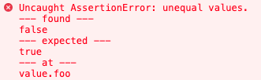

# Assert

[](https://github.com/jsenv/jsenv-assert/packages)
[](https://www.npmjs.com/package/@jsenv/assert)
[](https://github.com/jsenv/jsenv-assert/actions?workflow=ci)
[](https://codecov.io/gh/jsenv/jsenv-assert)

Assert actual matches expected.

## Table of contents

- [Presentation](#Presentation)
- [Example](#Example)
- [How it works](#How-it-works)
- [Successfull comparison examples](#Successfull-comparison-examples)
- [Failing comparison examples](#Failing-comparison-examples)
  - [Failing on value](#Failing-on-value)
  - [Failing on prototype](#Failing-on-prototype)
  - [Failing on property value](#Failing-on-property-value)
  - [Failing on properties order](#Failing-on-properties-order)
  - [Failing on property configurability](#Failing-on-property-configurability)
- [Why assert is strict](#Why-assert-is-strict)
- [Browser usage](#Browser-usage)
- [Node usage](#Node-usage)
- [Installation](#Installation)

## Presentation

jsenv/jsenv-assert github repository publishes `@jsenv/assert` package on github and npm package registries.

`@jsenv/assert` compare two values with extreme accuracy. If values differ, an error is thrown with a readable message.
`@jsenv/assert` helps you to know if the `actual` value produced in a test matches what you `expected`.

## Example

```js
assert({ actual, expected })
```

## How it works

`assert` does nothing when `actual` and `expected` comparison is successfull.<br />
`assert` throw an error if `actual` and `expected` comparison is failing.

`actual` and `expected` can be different objects but they must deeply look alike in every aspects possible in JavaScript.

To better understand if comparison will fail or not let's see some successfull comparison first and some failing comparisons afterwards.

## Successfull comparison examples

```js
import { assert } from "@dmail/assert"

// dates
{
  const actual = new Date()
  const expected = new Date()

  assert({ actual, expected })
}

// errors
{
  const actual = new Error("message")
  const expected = new Error("message")

  assert({ actual, expected })
}

// objects without prototype
{
  const actual = Object.create(null)
  const expected = Object.create(null)

  assert({ actual, expected })
}

// regexps
{
  const actual = /ok/
  const expected = /ok/

  assert({ actual, expected })
}
```

## Failing comparison examples

Various code examples where comparison between `actual` and `expected` is failing.<br />
Each code example is followed with the console output.

### Failing on value

```js
import { assert } from "@dmail/assert"

const actual = 10
const expected = "10"

try {
  assert({ actual, expected })
} catch (e) {
  console.log(e.message)
}
```

Console output

```console
AssertionError: unequal values.
--- found ---
10
--- expected ---
"10"
--- at ---
value
```

### Failing on prototype

```js
import { assert } from "@dmail/assert"

const actual = new TypeError()
const expected = new Error()

try {
  assert({ actual, expected })
} catch (e) {
  console.log(e.message)
}
```

Console output

```console
AssertionError: unequal prototypes.
--- prototype found ---
global.TypeError.prototype
--- prototype expected ---
global.Error.prototype
--- at ---
value[[Prototype]]
```

### Failing on property value

```js
import { assert } from "@dmail/assert"

const actual = { foo: true }
const expected = { foo: false }

try {
  assert({ actual, expected })
} catch (e) {
  console.log(e.message)
}
```

Console output

```console
AssertionError: unequal values.
--- found ---
true
--- expected ---
false
--- at ---
value.foo
```

### Failing on properties order

```js
import { assert } from "@dmail/assert"

const actual = { foo: true, bar: true }
const expected = { bar: true, foo: true }

try {
  assert({ actual, expected })
} catch (e) {
  console.log(e.message)
}
```

Console output

```console
AssertionError: unexpected properties order.
--- properties order found ---
"foo"
"bar"
--- properties order expected ---
"bar"
"foo"
--- at ---
value
```

### Failing on property configurability

```js
import { assert } from "@dmail/assert"

const actual = Object.defineProperty({}, "answer", { value: 42 })
const expected = { answer: 42 }

try {
  assert({ actual, expected })
} catch (e) {
  console.log(e.message)
}
```

Console output

```console
AssertionError: unequal values.
--- found ---
"non-configurable"
--- expected ---
"configurable"
--- at ---
value.answer[[Configurable]]
```

## Why assert is strict ?

As shown `assert` is strict on `actual` / `expected` comparison.<br />
It is strict because your test ensure your interface does not break a given contract.
You contract might be something like:

> calling function named `whatever` returns value `42`.

And any subtle change in your implementation might break the contract and things relying on it.

That being said, you can stay flexible by testing only a part of the value. Let's illustrate this with an example:

- you want to test a function called `whatever`
- you want to ensure it returns an object with `answer: 42`
- you don't want to ensure returned object contains only `answer: 42`

```js
import { assert } from "@dmail/assert"
import { whatever } from "./whatever.js"

const { answer } = whatever()
const actual = { answer }
const expected = { answer: 42 }
assert({ actual, expected })
```

## Browser usage

```html
<script src="https://unpkg.com/@jsenv/assert@latest/dist/global/main.js"></script>
<script>
  const { assert } = window.__jsenv_assert__

  const actual = { foo: false }
  const expected = { foo: true }
  assert({ actual, expected })
</script>
```

Screnshot below is a part of console content after executing above code inside chrome.



— see also https://jsenv.github.io/jsenv-assert/browser-interactive-example/browser-interactive-example.html.

## Node usage

```js
const { assert } = require("@dmail/assert")

const actual = { foo: false }
const expected = { foo: true }
assert({ actual, expected })
```

Screnshot below is a part of terminal output after executing above code inside node.js.


— see also https://jsenv.github.io/jsenv-assert/node-interactive-example/node-interactive-example.html

## Installation

If you have never installed a jsenv package, read [Installing a jsenv package](https://github.com/jsenv/jsenv-core/blob/master/docs/installing-jsenv-package.md#installing-a-jsenv-package) before going further.

This documentation is up-to-date with a specific version so prefer any of the following commands

```console
npm install @jsenv/assert@1.1.1
```

```console
yarn add @jsenv/assert@1.1.1
```
